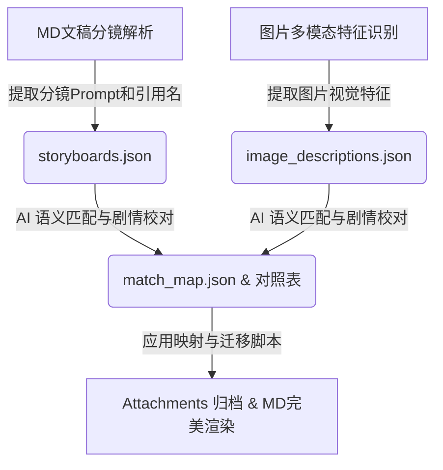

# 自动分镜图重命名与资产迁移技能 (Image Auto-Rename Skill)

本技能旨在为自媒体视频制作流中，自动将 Midjourney / DALL-E 生成的乱序图片，与 Markdown 文稿中的分镜提示词进行多模态语义匹配，完成自动化重命名并迁移至文档附件区（`Attachments/`），确保 Obsidian 等渲染工具能直接以 `![[refName.png]]` 的形式完美加载。

---

## 1. 核心架构与业务流程

整个技能管道（Pipeline）分为四个核心步骤，形成一个闭环，支持增量运行与断点续传：



1. **第 1 步：Markdown 解析提取 (`scripts/extract-md-refs.ps1`)**
   * 从口播文案分镜设计章节（`## 口播文案分镜设计`）顺序解析，将分镜 Prompt 和预设的 `![[47-x.png]]` 引用文件名绑定，提取为 `storyboards.json`。
2. **第 2 步：多模态图片识别 (`scripts/recognize-images-servicehub.ps1` / `scripts/recognize-images.ps1`)**
   * 读取存放下载图的目录，调用 ServiceHub 的 MiniMax-M3 多模态模型进行批量识别。
   * 采用**结构化提示词**，提取每张图的主体角色、动作姿态、面部表情、核心背景与道具、画风与色调，形成 `image_descriptions.json`。具备增量跳过已识别图的断点续传能力。
3. **第 3 步：语义匹配与冲突消除 (AI Agent 脑内校对)**
   * AI 基于内容一致性（人物一致性、动作演进、道具与剧情走向）进行多对多校对，将 `image_descriptions.json` 的原文件名和 `storyboards.json` 中的目标引用文件名进行 1:1 配对。
   * 输出具有幂等性的映射表 `match_map.json` 及人可读的 `image_match_map.md`。
4. **第 4 步：执行映射与迁移 (`scripts/apply-mapping.ps1`)**
   * 读取 `match_map.json`，在下载目录下进行原子重命名，并将高置信度命中的图片复制到 Markdown 所在的同级 `Attachments/` 文件夹下。

---

## 2. 文件目录结构

```text
skill-image-auto-rename/
├─ SKILL.md                          # 技能入口（声明工作流规范与决策规则）
├─ INSTALL.md                        # 安装指南（全局部署与局部部署说明）
├─ README.md                         # 本文档（系统架构与设计说明）
├─ .env.example                      # 凭证配置模板（不含真实值）
├─ .gitignore                        # 强制忽略 .env 与运行产物
├─ commands/                         # Claude Code 手动调用兼容层
│  └─ skill-image-auto-rename.md     # 同名 legacy command（复制到 ~/.claude/commands/）
├─ references/                       # 核心规范与接口说明
│  ├─ md-format-spec.md              # Markdown 分镜设计排版规范
│  ├─ tool-servicehub-api.md         # ServiceHub M3 多模态接口规范（主选）
│  ├─ tool-mmx-cli-legacy.md         # mmx CLI 工具备用规范
│  └─ troubleshooting.md             # 常见故障排查手册
└─ scripts/                          # 核心执行脚本（PowerShell）
   ├─ extract-md-refs.ps1            # 解析文稿生成 storyboards.json
   ├─ recognize-images-servicehub.ps1 # 增量多模态识别脚本（推荐）
   ├─ recognize-images.ps1           # 增量多模态识别脚本（备用）
   └─ apply-mapping.ps1              # 重命名并复制文件至 Attachments/
```

---

## 3. 核心设计决策 (Design Decisions)

* **绝对文件名映射，杜绝索引漂移**：匹配结果使用 `filename` 映射 `refName`，即使匹配被中途打断、文件排序发生变更或多次重复运行，也绝对不会造成顺序错乱，完全幂等。
* **内容一致性第一，时间线仅做辅助**：视觉特征（人物、动作、道具、表情、画风）是匹配的决策依据；图片生成时间（LastWriteTime）只作为"疑似线索"提示，不作为最终决策——同款角色、相似姿态的分镜时间靠得近不代表就是它，必须用特征 + 剧情走向二次确认。
* **多图多引用冲突消解**：同一张图被多个分镜命中、或同一引用被多张图命中时，必须启用 Tie-Breaker 微小差异对比（表情、道具细节、剧情递进），并把次优候选的 `refName` 标记为空 `""`，让重命名脚本安全跳过，避免误占位。
* **无匹配容错处理**：如生成的图片数量多于分镜数量（如废弃废稿），对应 `refName` 会被标空 `""`，重命名脚本将安全跳过，防止误删用户资产。
* **按置信度分流**：只有 `confidence = "high"` 的条目会进入重命名与复制；`medium` / `low` 条目应保留原文件名留在下载目录，便于人工复核。
* **幂等 + 断点续传**：脚本逐张处理，已识别的图、已重命名的图、已复制到 `Attachments/` 的文件都会自动跳过，再次运行不会重复扣费、不会覆盖、不会重复写入。

---

## 4. Obsidian 附件路径说明

本技能的输出路径是固定设计，不跟随 vault 的 Obsidian 配置自动漂移：

* **技能输出目录固定为**：`<MD 所在目录>\Attachments\`
* **不会读取** `.obsidian/app.json` 里的 `attachmentFolderPath`
* **不会因为** vault 默认附件目录设为 `./attachments`、`assets/` 或其他位置，就把脚本输出改到 vault 根

这两个概念必须分开：

* `attachmentFolderPath` 只影响你在 Obsidian 里新拖入/粘贴附件时，默认保存到哪里
* 本技能是在 Markdown 外部批量整理现有图片资产，目标就是让 `![[xxx.png]]` 能在当前 MD 文档上下文中直接解析

如果你的工作流希望 Obsidian 今后新增图片也统一落到 `当前文件夹下的子文件夹/Attachments`，需要在 Obsidian 设置中手动调整新增附件默认位置；这不是本技能自动修改的内容。

---

## 5. 获取与安装 (Get & Install)

### 克隆仓库 (Clone Repository)

```bash
git clone https://github.com/JasonCai2024/skill-image-auto-rename.git
```

安装配置详情，请参阅 [INSTALL.md](./INSTALL.md)。

---

## 6. 性能与耗时预期

`recognize-images-servicehub.ps1` 按图片逐张串行调用 MiniMax-M3。这是设计约束，不建议在技能侧叠加并发（例如 `Start-Job`、`RunspacePool`）去抢吞吐。

经验值可按：

* **6-8 秒/张** 估算纯识别耗时
* **78 张图** 通常约 **8-10 分钟** 纯接口时间
* 如果中途出现超时、网络重试、工具侧超时再续跑，**总耗时到 30 分钟仍属正常**

脚本支持增量写入和断点续传，所以遇到长任务时，正确处理方式是重跑同一命令继续，而不是人为改造成并发版本。

---

## 7. 凭证安全与隔离规范 (Credential Security)

本技能完全符合 `OpenClaw 智能体技能开发规范：凭证安全与隔离方案` 规范：
* **无凭据泄露风险**：所有代码库文件（包括脚本和配置文件）均无硬编码的用户名、密码或 API 密钥。
* **本地配置文件**：敏感凭据统一存放于本地技能根目录下的 `.env` 文件中。`.gitignore` 已对 `.env` 及其本地变体进行强制拦截。
* **配置范式**：仓库中提供了一个 [`.env.example`](./.env.example) 模版。开源用户可以复制该文件为 `.env` 并填入自己的服务凭证，或者通过设置以下环境变量使技能自动读取：
  * `SERVICETUBER_USERNAME`：您的 ServiceHub 账户用户名。
  * `SERVICETUBER_PASSTOKEN`：您的 ServiceHub 账号授权令牌 (passtoken)。
  * `SERVICETUBER_BASE_URL`：ServiceHub 的接口基础 URL（默认为 `https://www.ccailab.top`）。

---

## 8. 仓库地址与本机凭证

本仓库的 GitHub 远端地址在 `git remote add origin` 时填入，**不应**由本仓库内容硬编码发布地址。

本机 GitHub 发布账号 / token / 推送方式等运维信息，只允许从以下本地文档读取，**严禁**在本 README、`SKILL.md` 或脚本中转抄其中的 token、密码或密钥：

```text
E:\BaiduSyncdisk\WorkSpace\Personal\外部API与服务管理\API调用信息.md
```

发布前请重新阅读 `INSTALL.md` 中"首次发布到 GitHub"章节，按占位符填入实际仓库地址。
